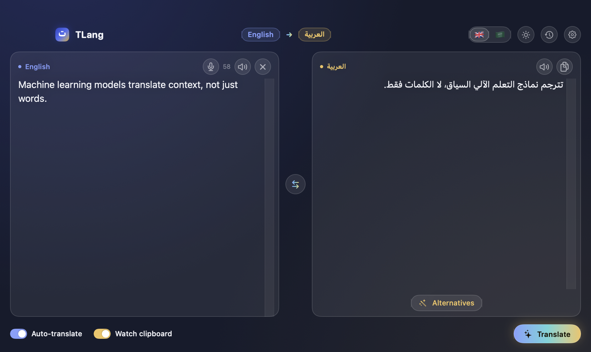
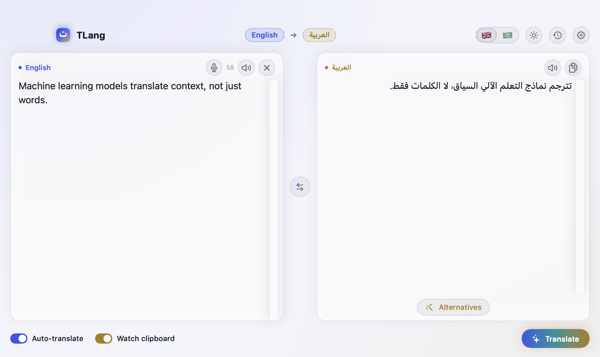
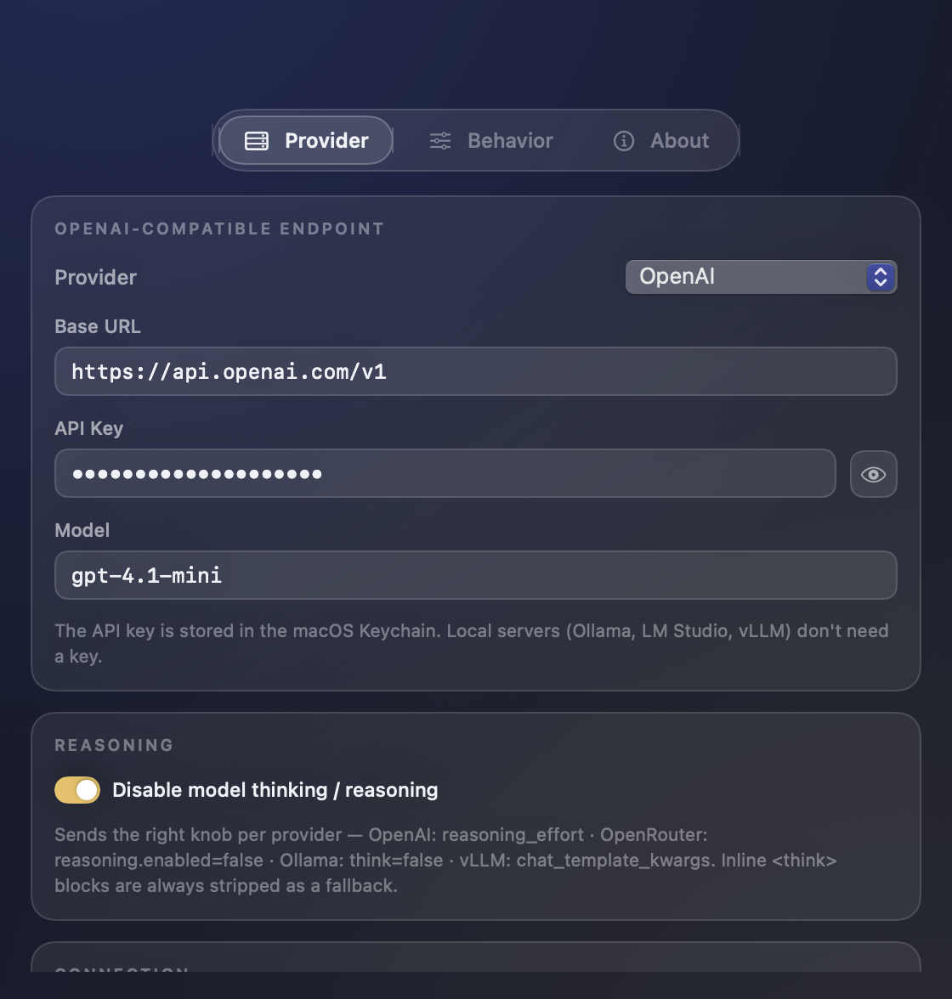

# TLang

Native macOS Arabic ⇄ English translator powered by any OpenAI-compatible
chat-completions API (OpenAI, OpenRouter, Ollama, LM Studio, vLLM, …).

**Made with Claude by [Raad Kasem](https://github.com/raadkasem)**

  

## Design — Lapis & Gold

Inspired by illuminated Arabic manuscripts: **English is lapis, Arabic is gold**,
and translation is the gradient between them. Full light & dark mode
(Auto / Light / Dark switch in the header), with Liquid Glass on macOS 26+.

| Dark | Light |
|------|-------|
|  |  |

<p align="center"></p>

## Features

- **Two-pane translator** — side-by-side editor with live streaming output, proper
  RTL rendering for Arabic, and automatic direction detection (no language picker).
- **Clipboard watcher** — copy text in any app while TLang is open and it is
  pasted and translated automatically.
- **Double ⌘C hotkey** — hold ⌘ and tap **C** twice on selected text anywhere:
  a floating mini-panel appears near the cursor with the translation. Works
  with both English and Arabic keyboard layouts.
- **Replace in place** — optional: the translation is pasted back over the
  original selection automatically.
- **Menu bar + full window** — a compact menu bar popover and a full translator
  window; optionally hide the Dock icon for menu-bar-only mode.
- **Text-to-speech** — speaker icon on every pane reads the text aloud with the
  best installed system voice for each language (offline, free).
- **Local history** — translations are saved to
  `~/Library/Application Support/TLang/history.json` (searchable, pinnable,
  never leaves your Mac; can be disabled).
- **Thinking disabled** — reasoning models are told not to "think", using the
  correct knob per provider; inline `<think>` blocks are stripped as a fallback.
- **Launch at login**, API key in the **Keychain**, streaming responses.

## Build

```bash
git clone https://github.com/raadkasem/T-Lang.git
cd T-Lang
./build.sh
cp -R build/TLang.app /Applications/
open /Applications/TLang.app
```

Requires Xcode (or Command Line Tools with the macOS SDK) on macOS 14+.

## Setup

Open **Settings → Provider** (⌘, or the gear icon) and pick a preset:

| Provider   | Base URL                          | API key | Thinking knob sent                          |
|------------|-----------------------------------|---------|---------------------------------------------|
| OpenAI     | `https://api.openai.com/v1`       | yes     | `reasoning_effort` (gpt-5 / o-series only)  |
| OpenRouter | `https://openrouter.ai/api/v1`    | yes     | `reasoning: {enabled: false}`               |
| Ollama     | `http://localhost:11434/v1`       | no      | `think: false`                              |
| LM Studio  | `http://localhost:1234/v1`        | no      | `<think>` stripping only                    |
| vLLM       | `http://localhost:8000/v1`        | no      | `chat_template_kwargs.enable_thinking=false`|
| Custom     | anything OpenAI-compatible        | optional| `<think>` stripping only                    |

Use **Test Connection** to verify — it translates "Hello" and shows the result.

For fully offline translation, run [Ollama](https://ollama.com)
(`ollama pull qwen3:8b`) or LM Studio and pick that preset.

## Permissions

The double-⌘C hotkey and replace-in-place use synthetic key events, which need
**System Settings → Privacy & Security → Accessibility** access. TLang prompts
the first time you enable either feature; flip the toggle for TLang in that
list. Settings → Behavior shows the current permission status.

Note: rebuilding the app re-signs it ad hoc, so macOS may ask you to re-grant
Accessibility after a rebuild (remove and re-add TLang in the list).

## Usage

| Action | How |
|---|---|
| Translate | type/paste — auto-translates as you type (or ⌘↩) |
| Stop a translation | ⌘. or the Stop button |
| Translate any copied text | just copy it while TLang is running |
| Floating translator | hold ⌘, tap C twice on a selection in any app |
| Replace selection with translation | enable *Replace in place*, then double ⌘C |
| Back-translate | the ⇄ swap button |
| History | clock icon in the main window — search, pin, click to reload |

## Project layout

```
Sources/TLang/
├── TLangApp.swift            # entry point (menu bar scene)
├── AppDelegate.swift         # windows, main menu, edit-shortcut handling
├── Models/                   # settings, providers, history, language detection
├── Services/                 # API streaming, clipboard, hotkey, paste, keychain
├── ViewModels/               # translation state machine (debounce, streaming)
└── UI/                       # main window, menu bar, settings, floating panel
```

## License

Licensed under the [Apache License 2.0](LICENSE).

## Credits

Made with [Claude](https://claude.com/claude-code) by
**[Raad Kasem](https://github.com/raadkasem)**.
